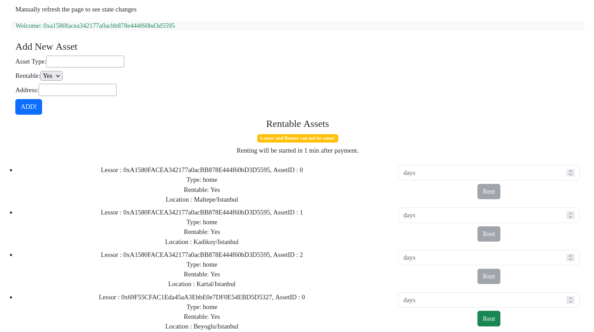
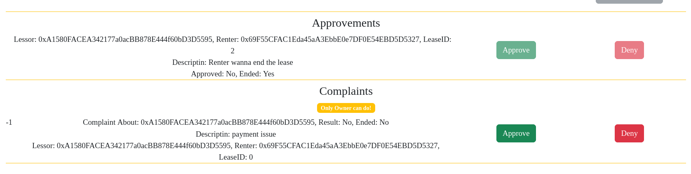

Contract Address(on sepolia network) : 0x02bc5679361c6f73891cfaF845a521AC6aA61089

Owner : 0xA1580FACEA342177a0acBB878E444f60bD3D5595

Paribu Hub - Smart Contract & Solidity Bootcamp , Final Project 

Heroku Deployement : https://radiant-shore-29745-3f026feac7b7.herokuapp.com/

**INSTALLING**
- Clone the project 
- run `npm install --save my-dependency` for solidity part
- go to client folder
- run `npm install --save my-dependency` for react part
- run `npm start`
- go `http://localhost:3000/`

Note : it don't filter the blocked users, so you can't rent some assets even if it is showed as rentable

# Project Detail

**Proje Hedefi**

Bu proje, bir kira yönetim sistemi oluşturmayı amaçlar. Sistem, kiracıların mülkleri kiralayabileceği ve mülk sahiplerinin kiracıları yönetebileceği bir platform sağlar.

**Adımlar**

**Kullanıcı Yönetimi:**

1. Kiracı ve mülk sahibi olmak üzere iki farklı tip kullanıcı oluşturulacak.
2. Her kullanıcı için gerekli bilgiler alınarak profilleri oluşturulacak.

**Mülk Bilgileri Tanımlama:**

1. Her kullanıcı mülkleri hakkında bilgi verebilir ve mülklerin özelliklerini tanımlayabilir.

**Sözleşme Yönetimi:**

1. Kiracılar, mülkleri seçebilir ve başlangıç ile bitiş tarihlerini girerek sözleşmeler başlatabilir.
2. Erken tarihli sözleşmelerin sonlandırılması talepleri alınır ve onay bekler.
3. Kiracılar, erken tarihli sözleşmeleri sonlandırma talebinde bulunabilecek ve bu durumda sözleşmede herhangi bir işlem yapılmayacak.
4. Sözleşmelerin sonlandırılması için kiracılar ve mülk sahiplerinin onayı gerekmektedir.

**Şikayet Yönetimi:**

1. Kiracılar ve mülk sahipleri, sistemde şikayette bulunabilir.
2. Tüm şikayetler kaydedilmelidir.

**Yetki Kontrolleri:**

1. Aynı kullanıcının hem kiracı hem de mülk sahibi olması engellenmelidir.
2. Kullanıcılar sadece yetki ve rolleri doğrultusunda işlem yapabilirler.
